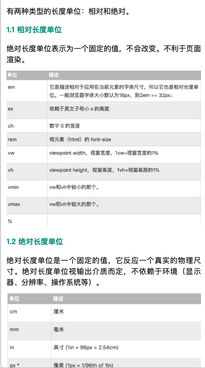
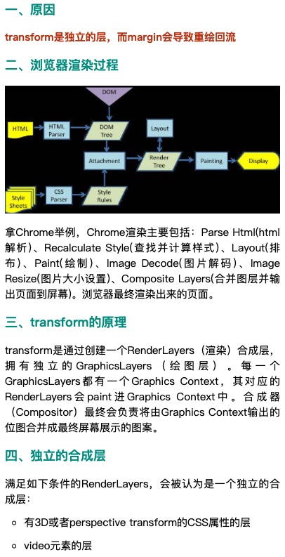
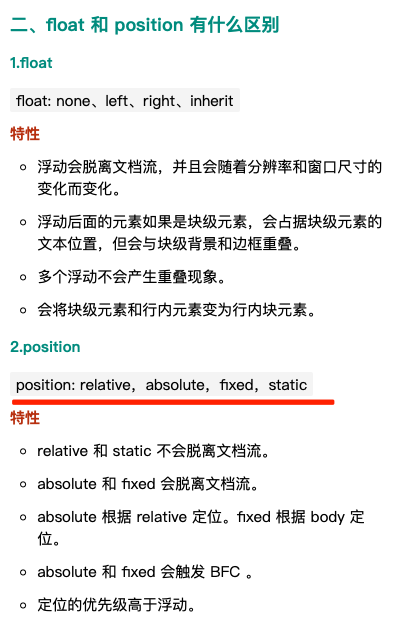
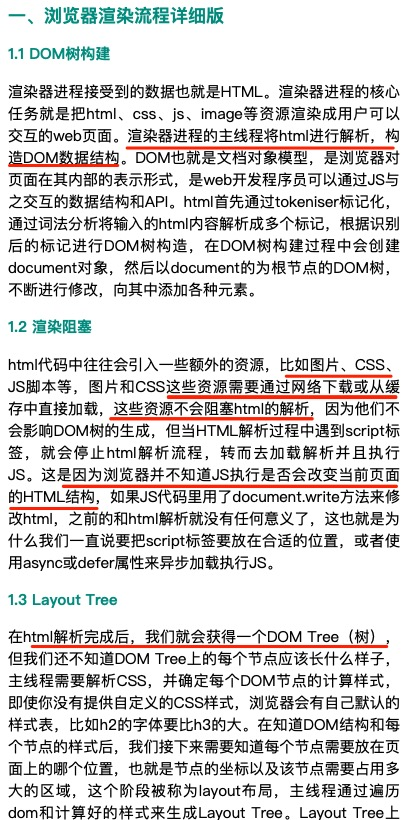
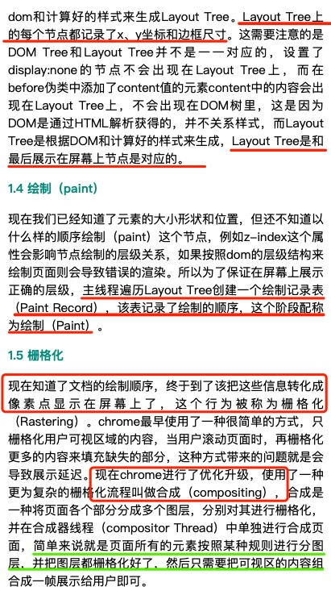
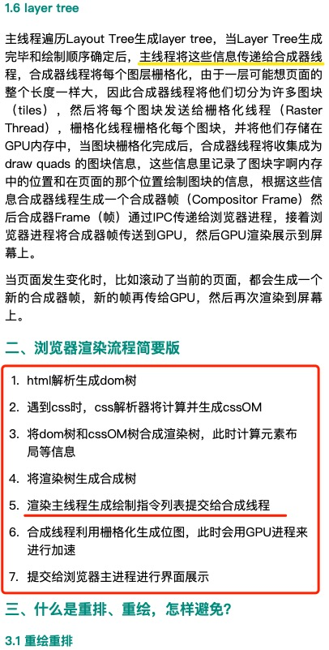
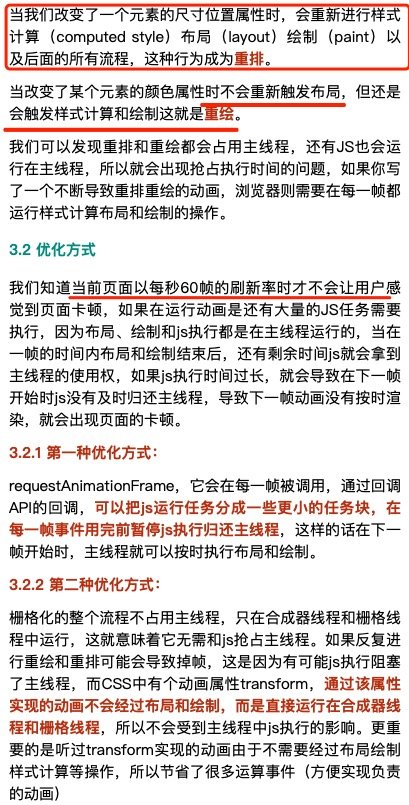
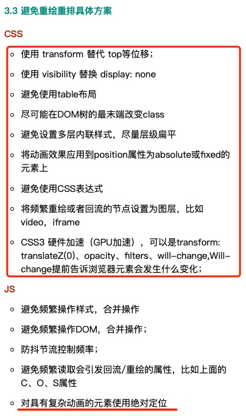
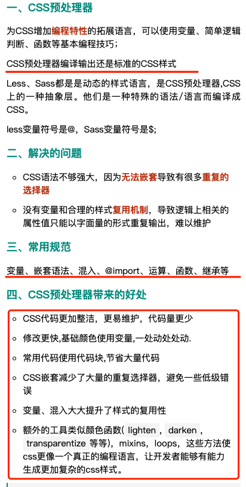

# css

## css 的 伪类 和 伪元素 有什么区别？


## css 的 link 和 @import 有什么区别？


## 说一下盒模型的区别？border-box 和 content-box 的区别？


## css 怎么实现动画？


## css 的单位有哪些？


## 居中为什么使用 transform（为什么不使用 marginleft 和 marginTop）？



## 怎么解决移动端适配 1px 的问题？
#### 起因： 移动端window对象有个devicePixelRatio属性,它表示设备物理像素和css像素的比例, 在retina屏的iphone手机上, 这个值为2或3,css里写的1px长度映射到物理像素上就有2px或3px那么长；
#### 解决方案： 1.用小数来写px值 （不推荐）
```js
IOS8下已经支持带小数的px值, media query 对应 devicePixelRatio 有个查询值 -webkit-min-device-pixel-ratio, 
css可以写成这样通过-webkit-min-device-pixel-ratio设置。
.border { border: 1px solid #999 }
@media screen and (-webkit-min-device-pixel-ratio: 2) {
  .border { border: 0.5px solid #999 }
}
@media screen and (-webkit-min-device-pixel-ratio: 3) {
  .border { border: 0.333333px solid #999 }
}

如果使用less/sass的话只是加了1句mixin。
缺点: 安卓与低版本IOS不适用, 这个或许是未来的标准写法, 现在不做指望。
```

#### 解决方案： 2.flexible.js
```js
前面已经说过1px变粗的原因就在于一刀切的设置 viewport 宽度, 如果能把 viewport 宽度设置为实际的设备物理宽度, 
css 里的 1px 不就等于实际 1px 长了么. flexible.js 就是这样干的.
<meta name=”viewport”>里面的 scale 值指的是对 ideal viewport 的缩放, flexible.js 检测到 IOS 机型, 会算出 scale = 1/devicePixelRatio, 然后设置viewport。
```

## em，rem 和 px 的区别？


## 介绍一下 flex 布局？
```
Flex 意为"弹性布局"，用来为盒状模型提供最大的灵活性。

https://www.ruanyifeng.com/blog/2015/07/flex-grammar.html
```

## float和 position有什么区别？


## 说一下浏览器的渲染流程，说一下什么是重回重排，哪些操作会造成重绘重排？





```
触发的一些因素：
1.页面首次进入的渲染。
2.浏览器的 resize。
3.元素位置和尺寸发生改变的时候。
4.可见元素的增删。
5.内容发生改变。
6.字体的 font 的改版。
7.css 的伪类激活。
```

## css 预处理。less sass 带来的好处？
