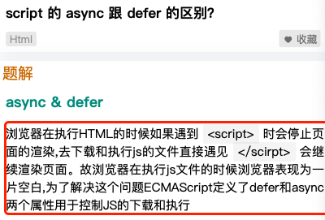
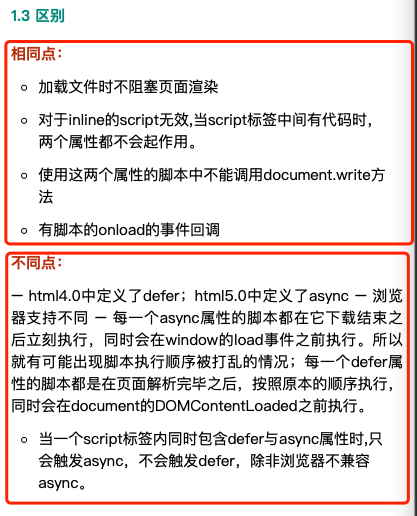
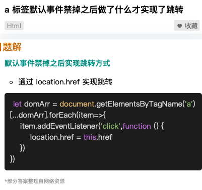
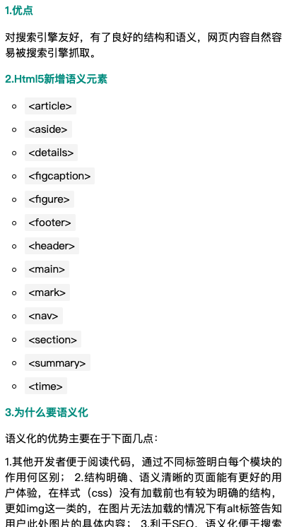

# html


## 减少 dom 的数量，一次性给大量的 dom 怎么优化？

- 1. 减少 dom 数量，减少不必要的 渲染， 按需加载。
- 2. 大量 dom 的优化 
```
1.缓存 dom 对象。
2.使用文档片段 document.createDocumentFragment（）去创建文档碎片。
3.用 innerHtml 代替高频的 appendChild。
4.虚拟 dom，通过 domdiff 将虚拟 dom 和原 dom 进行对比，最后去修改真实的 dom，竟可能的避免频繁的重排和重绘。

```
## script 的 async 和 defer 有什么区别？



## a标签的默认事件禁掉后怎么才能实现跳转？


## 说一下了解的 HTML5 的语义化标签？


## 说一下使用data-属性的好处是什么？
``` html
data- 属性用于存储页面或应用程序的私有自定义数据
data- 属性赋予我们在所有 HTML 元素上嵌入自定义 data 属性的能力。
存储的(自定义)数据能够被页面的 JS 中利用，以创建更好的用户体验(不进行 Ajax 调用或服务器端数据库查询)

<element data-*="somevalue">

好处：
    H5 的新属性
    自定义属性，可以被 JS 很好的操作
    通过 JS 的 element.dataset.*   或 jQuery 的 data('*') 拿到，* 可以为 url 等字符
    不支持 dataset 属性的浏览器可以通过 getAttribute方法获取 :
    框架的数据绑定，如 data-ng-if="cs==1"
```