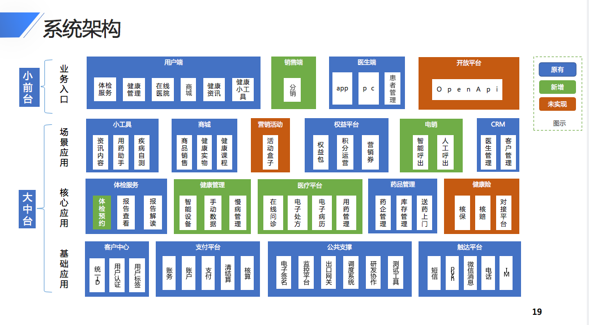

# 面试
## 面试导图

  
## 执行上下文/作用域链/闭包
####  介绍一下 js 的执行上下文？
  > JavaScript代码在执行时，会进入一个执行上下文中。 执行上下文可以理解为当前代码的运行环境。
  JavaScript 中的运行环境主要包括以下 三种情况。 
- 全局环境: 代码运行起来后会首先进入全局环境。
- 函数环境: 当函数被调用执行时，会进入当前函数中执行代码 。 
- eval 环境: 不建议使用，这里不做介绍 。
JavaScript 引 擎会 以栈的方式来处理它们，这个栈，就是前面多次提到的函数调用钱 。 

## 涂鸦

- es5 是怎么模拟实现 class 的?
- http 状态码具体代表什么?
- 什么是闭包?
- 什么是 事件循环?
- 说一下egg中间件的运行过程?
- koa 聊一下?
- yjk-sdk 的 webview 实现原理?
- vue 的双向绑定原理


## 自我总结
```
广度深度两手抓，
一是主动承担业务，主动解决问题。
二是技术栈也不要给自己设限，React, Vue, 客户端开发，Node，Canvas ... 撸起袖子就是干，
当然拓展广度的同时，对于目前紧迫的业务涉及的技术也需要深入了解，买书，买视频，多多投资自己。

```

## 业务架构图


## 技术架构图
